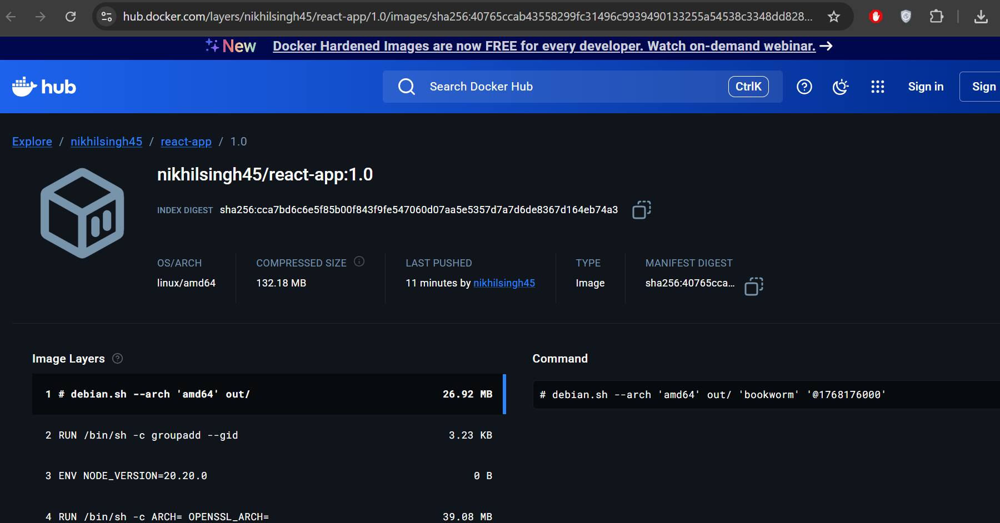
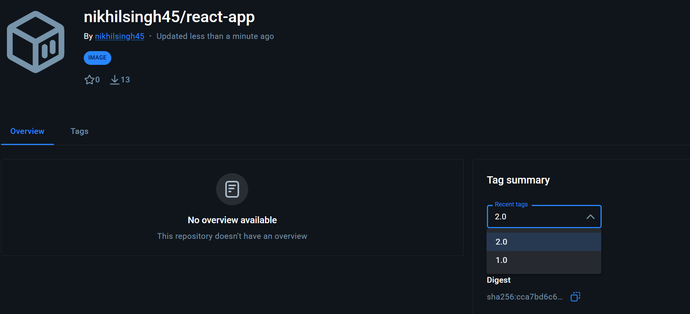

Commands to create An image :
 docker run hello-world

Create React app
npm create vite@latest react-app

Start this :
  cd react-app
  npm install
  npm run dev

 Adding Docker file in app location  
   >dockerignore    
   >Dockerfile
    
Building Docker APP
 docker build -t react-app:1.0 
 docker run -p 5173:5173 react-app:1.0

Application Running at :
 http://localhost:5173
 

 ### Process for Angular App

   npm install -g @angular/cli
   ng version
   ng new angular-app

Running Application:
   cd angular-app
   ng serve  

Adding Docker file in app location : 
   >dockerignore    
   >Dockerfile

Building Docker APP:
docker build -t angular-app:1.0 

docker run -p 4200:4200 angular-app:1.0

http://localhost:4200

## What We havw done till data 

| Concept           | React    | Angular   |
| ----------------- | -------- | --------- |
| Local dev server  | ✔        | ✔         |
| Docker wrapping   | ✔        | ✔         |
| Port exposure     | 5173     | 4200      |
| Host binding      | `--host` | `0.0.0.0` |
| Same Docker logic | ✔        | ✔         |

# What we had done 
Dockerfile  →  docker build  →  Docker Image (local only)

# Next Steps 
Docker Image  →  docker push  →  Docker Hub (remote registry)

One-line truth (remember this)

Dockerfile is the template.
Docker image is the artifact.
Docker Hub is the warehouse.
Container is the runtime.
## For React APP
# Now lets create an Docker Image :
 User Name:nikhilsingh45
 Image Name: react-app:1.0
 Syntax: <dockerhub-username>/<image-name>:<tag>
# Similarly our formate as of code:
 docker tag react-app:1.0 nikhilsingh45/react-app:1.0
  Path:(C:\Users\amit\Desktop\Dock Test\Docker\react-app>docker tag react-app:1.0 nikhilsingh45/react-app:1.0)
# Push the same to docker  
 docker push nikhilsingh45/react-app:1.0
 Path:(C:\Users\amit\Desktop\Dock Test\Docker\react-app>docker push nikhilsingh45/react-app:1.0)
# Now in Docker HUB:
 Repository: react-app
 Tag: 1.0
 Owner: nikhilsingh45
This proves that the application is deployed on Docker Hub

| State                | Exists now? |
| -------------------- | ----------- |
| Source code          | ✅ yes       |
| Dockerfile           | ✅ yes       |
| Local image          | ✅ yes       |
| Local containers     | optional    |
| Tagged image         | ✅ yes       |
| Docker Hub image     | ✅ yes       |
| Digest (immutable)   | ✅ yes       |
| Layered architecture | ✅ yes       |

 Loges:
 C:\Users\amit\Desktop\Dock Test\Docker\react-app>docker push nikhilsingh45/react-app:1.0
 The push refers to repository [docker.io/nikhilsingh45/react-app]
 ffdfab199ea0: Pushed
 c02d17997ce3: Pushed
 827dcaf69d21: Pushed
 024b9523dc7f: Pushed
 7aef6704daeb: Pushed
 07bb95032a0c: Pushed
 a98168ca575a: Pushed
 7d393bf487b0: Pushed
 34df1d831cbe: Pushed
 ebe53019ce11: Pushed
 1.0: digest: sha256:cca7bd6c6e5f85b00f843f9fe547060d07aa5e5357d7a7d6de8367d164eb74a3 size: 856

This loges specify that react app which was pushed sucesfully to Docker

 ## For Angular APP

 # Now lets create an Docker Image :
 User Name:nikhilsingh45
 Image Name: angular-app:1.0
 Syntax: <dockerhub-username>/<image-name>:<tag>

 docker tag angular-app:1.0 nikhilsingh45/angular-app:1.0

 # Push the same to docker  
 docker push nikhilsingh45/angular-app:1.0

# Now in Docker HUB:

Loges :
C:\Users\amit\Desktop\Dock Test\Docker\angular-app> docker push nikhilsingh45/angular-app:1.0
The push refers to repository [docker.io/nikhilsingh45/angular-app]
024b9523dc7f: Mounted from nikhilsingh45/react-app
7ce41dddfcbe: Pushed
ffdfab199ea0: Mounted from nikhilsingh45/react-app
bd5d7fad8340: Pushed
7d393bf487b0: Mounted from nikhilsingh45/react-app
c02d17997ce3: Mounted from nikhilsingh45/react-app
35399b6820ad: Pushed
ebe53019ce11: Mounted from nikhilsingh45/react-app
eaeff69b59a1: Pushed
a98168ca575a: Mounted from nikhilsingh45/react-app
1.0: digest: sha256:6552a1dd951872a57cfa835d8b60cc12861136226b775beda93546b0951963b6 size: 856

Explanation:
  This happens becouse most of the dependencies are already present in our 1st react app so it reuses those insted or re-creating 

# Now we are updating the tages based on new changes of code:
 in case we dont have this app 
   docker pull nikhilsingh45/react-app
After changing the code we add 
   Syntal:
   nikhilsingh45/react-app:latest
   Commend:
   docker tag nikhilsingh45/react-app:1.0 nikhilsingh45/react-app:2.0
Loges :
docker images | findstr react-app

C:\Users\amit\Desktop\Dock Test\Docker\react-app>docker images | findstr react-app
react-app                   1.0              cca7bd6c6e5f   22 hours ago   516MB
nikhilsingh45/react-app     1.0              cca7bd6c6e5f   22 hours ago   516MB
nikhilsingh45/react-app     2.0              cca7bd6c6e5f   22 hours ago   516MB

# Push the code to docker 
docker push nikhilsingh45/react-app:2.0
Loges :
C:\Users\amit\Desktop\Dock Test\Docker\react-app>docker push nikhilsingh45/react-app:2.0
The push refers to repository [docker.io/nikhilsingh45/react-app]
07bb95032a0c: Already exists
024b9523dc7f: Layer already exists
ffdfab199ea0: Layer already exists
ebe53019ce11: Layer already exists
827dcaf69d21: Layer already exists
c02d17997ce3: Layer already exists
7aef6704daeb: Layer already exists
34df1d831cbe: Layer already exists
7d393bf487b0: Layer already exists
a98168ca575a: Layer already exists
2.0: digest: sha256:cca7bd6c6e5f85b00f843f9fe547060d07aa5e5357d7a7d6de8367d164eb74a3 size: 856

We shall see somthing like this 

# For angular 

docker tag nikhilsingh45/angular-app:1.0 nikhilsingh45/angular-app:1.0.1

docker push nikhilsingh45/angular-app:1.0.1

## Creating production push

Mental model (lock this)
Source code ──► Build (Node) ──► Static files ──► Serve (Nginx)

